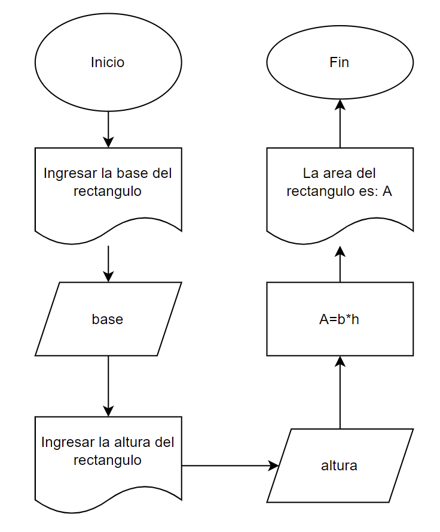

# Apuntes de programacion

## Workshop 1: 14 Nov Introducion programacion

|Atajos |Utilidad  |
|---------|----------|
|gcc --version|para seber si tengo el compilador|
|ctrl + |habre y cierra el terminal|
|ctrl + shift + P|     |
|ctrl + P| abridor rapido |
|ctrl + B| abre explorador |
|ctrl + D| selector muktiple |
|shift + alt + up or shift + alt + down  |copia lineas|
|shift + alt + A|**comment code block**|
|ctrl + T|muestra todos los simbolos|
|ctrl + space|genera sugerencias|

## Workshop 2: 15 Nov Git

|Comandos |Utilidad  |
|---------|----------|
|git version||
|pwd||
|ls||
|git init||
|git status||
|git add . ||
|git add "file"/""||
|echo "" >> .gitignore||
|git confing --global user.name ""||
|git confing --global user.email ""||

## Workshop 3: 16 Nov Markdown

En Markdown todos los archivos terminan en .md o .mdx.
|Comandos||
|---|---|
|# heading level 1
|## heading level 2
|### heading level 3
|#### heading level 4
|##### heading level 5
|###### heading level 6

## Workshop 4: Hello World

```c
#include <stdio.h>

void main()

{
    char nombre []="Sebas";
    printf("Hola %s",nombre);
}
```

## Workshop 5: Suma de numeros

```c
#include <stdio.h>

void main()
{
    int n1,n2,rta;
    n1=10;
    n2=20;
    rta=n1+n2;
    printf("La suma es:%i",rta);
}
```

**Algoritmia:** Estudia logaritmos que dan solucion a un problema tiene 4 partes:

1. Pseudocodigo: Lenguaje natural.
2. Diagrama de flujo: Solucion visual.
3. Codificacion: Programar.
4. Trace: Seguimiento o prueba de escritorio.

**Ejemplo:** Determine el area de un rectangulo

**Pseudicodigo:**

* imprimir "ingrese la base del rectangulo"
* leer base
* imprimir "ingrese la altura del rectangulo"
* leer altura
* area=base * altura
* imprimir "la area es" area

**Diagrama de flujo:**



**Codifcacion:**

```c
#include <stdio.h>

void main ()
{
    int n1,n2,area;
        
    printf("Introduce la base del rect: ");
    scanf("%d",&n1);

    printf("Introduce la altura del rect: ");
    scanf("%d",&n2);

    area=n1*n2;
    printf("La area es:%i",area);
}
```

## Workshop 6: Mayor de dos numeros

```c
#include <stdio.h>

void main()
{
    int n1,n2,a,b;

    printf("Ingresa primer numero: ");
    scanf("%i",&n1);

    printf("Ingresa segundo numero: ");
    scanf("%i",&n2);

    if(n1>n2)
        printf("El mayor es el primer numero");
    if(n2>n1)
        printf("El mayor es el segundo numero");
    if(n1==n2)
        printf("Son iguales");
}
```

## Workshop 7: Bucles

```c
#include <stdio.h>

void generarCuadrado(int signoAlterno)
{
    for (int i = 0; i < signoAlterno; i++)
    {
        for (int j = 0; j < signoAlterno; j++)
            if ((i == 0) || (j == 0) || (i == signoAlterno - 1) || (j == signoAlterno - 1))
                if ((i + j) % 2 == 0)
                    printf("+ ");
                else
                    printf("- ");
            else
                printf("  ");
        printf("\n\n");
    }
}

int main()
{
    int numeroSigno = 0;

    printf("Ingrese el numero de signos: ");
    scanf("%i", &numeroSigno);

    // generarCuadrado(numeroSigno);
    for (int i = 0; i < numeroSigno; i++)
    {
        if (i % 2 == 0)
            printf("+ ");
        else
            printf("- ");
        if (i % 2 == 0)
            printf("* ");
        else
            printf("& ");
    }

    return 0;
}
```

## Workshop 8: Escalera

```c
#include <stdio.h>

void generarEsacalera(int signoAlternoEscalera)
{
    for (int i = 1; i <= signoAlternoEscalera; i++)
    {
        for (int j = 1; j <= signoAlternoEscalera; j++)
        {
            if ((j % 2 == 1)&&(i == j))
                printf(("|_+_ "));
            if ((i % 2 == 0) && (i == j))
                printf(("|_-_ "));
            else
                ((i != j));
            printf(("    "));
        }
        printf("\n");
    }
}

int main()
{
    int numeroEscalon = 0;
    printf("Ingrese el numero de escalones: ");
    scanf("%i", &numeroEscalon);

    generarEsacalera(numeroEscalon);

    return 0;
}
```

## Workshop 9: Array

```c
#include <stdio.h>

void juegoLobo()
{
    int personajes;
    int nroPersonajes [] = {0, 1, 2, 3, 4};

    printf("El juego consiste en que 4 personajes tienen que cruzar un rio mediante una barca de tan solo dos asientos \n\n");
    printf(" Regresa solo=0 \n Vigilante=1 \n Lobo=2 \n Caperucita=3 \n Uvas=4 \n\n ");
    printf("Tomando en cuenta que uno de los asientos siempre sera ocupado por el vigilante, ademas el lobo se come a la caperucita y la caperucita se como las uvas, en que orden deben de cruzar el rio? \n\n");

    printf("Quien cruza primero: ");
    scanf("%i", &personajes);

    if (personajes != 3)
        printf("PERDISTE");
        break;
        printf("\n");
    if (personajes == 3)
        printf("Regresa solo o con alguien?: ");
        scanf("%i", &personajes);
        printf("\n");

    if (personajes != 0 )
        printf("PERDISTE");
        break;
    if (personajes == 0)
        printf("Quien cruza segundo: ");
        scanf("%i", &personajes);

    if (personajes != 2)
        printf("PERDISTE");
        break;
        printf("\n");
    if (personajes == 2)
        printf("Regresa solo o con alguien: ");
        scanf("%i", &personajes);
        printf("\n");

    if (personajes != 3 )
        printf("PERDISTE");
        break;
        printf("\n");
    if (personajes == 3)
        printf("Quien cruza tercero: ");
        scanf("%i", &personajes);
        printf("\n");

    if (personajes != 4)
        printf("PERDISTE");
        break;
        printf("\n");
    if (personajes == 4)
        printf("Regresa solo o con alguien: ");
        scanf("%i", &personajes);
        printf("\n");
    
    if (personajes != 0 )
        printf("PERDISTE");
        break;
        printf("\n");
    if (personajes == 0)
        printf("Quien es el ultimo en cruzar?: ");
        scanf("%i", &personajes);
        printf("\n");
    
    if (personajes != 3)
        printf("PERDISTE");
        break;
        printf("\n");
    if (personajes == 3)
        printf("FELICIDADES CONSEGUSTE QUE TODOS PASEN EL RIO!!!");
        printf("\n");
    
}

void main ()
{
    juegoLobo();
}
```

## Workshop 10: Matriz

```c
#include <stdio.h>

void inicalNombre ()
{
    char logoInicial[7][5] = {
                         {'*','*','*','*','*'}
                        ,{'*','*','*','*','*'}
                        ,{'*','*','*','*','*'}
                        ,{'*','*','*','*','*'}
                        ,{'*','*','*','*','*'}
                        ,{'*','*','*','*','*'}
                        ,{'*','*','*','*','*'}
                    };
    int fila = sizeof (logoInicial)/sizeof(logoInicial[0]);
    int columna = sizeof (logoInicial[0])/sizeof(logoInicial[0][0]);
  
    for (int fi = 0; fi < fila; fi++)
    {
        for (int ci = 0; ci < columna; ci++)
        {
            if ((fi == 0) || (fi == 3) || (fi == 6) || ((fi == 1 && ci == 0)) || ((fi == 2 && ci == 0)) || ((fi == 4 && ci == 4)) || ((fi == 5 && ci == 4)))
                printf (" %c ", logoInicial[fi][ci]);
            else
                printf ("   ");
        }
        printf("\n");
    
    }
}

void main ()
{
    inicalNombre();  
}
```

## Workshop 11: c++

|c        |c++       |
|---------|----------|
|#include <stdio.h>  |#include <iostream.>  |
|std :: cout << "Hola";      | printf ("Hola");          |
|std :: cin >> nombre;  |  scandf ("%i",&nombre);        |
|std :: cout << endl; |printf("\n");

**Observacion:** Podemos usar "using namespace std;" al inicio para evitar usar "std ::".

## Workshop 12: Archivos

```c
#include <iostream>
#include <fstream> //para archivos
using namespace std;

void leerArchivo (string pathfile){

    int parrafos=1;
    string s;
    ifstream f (pathfile);

    if (!f.is_open())
        cerr << "Error al abrir el archivo."<< endl;
    else
        do {
            getline(f,s);
            cout << s << endl;

            if (parrafos++%2==0)
            getchar();

        }while (!f.eof());
    f.close();
        


}

void escribirArchivo(string pathfile){

    ofstream f;
    
    f.open (pathfile, ios_base::out); // borra y agrega
    f.open (pathfile, ios_base::app); // agrega sin borrar

    f<<"Humano 1\n";
    f<<"Humano 2\n";
    f<<"Humano 3\n";
    f.close();
}

int main (){
    leerArchivo ("files\\texto1.txt");
    escribirArchivo ("files\\texto2.txt");
}
```
